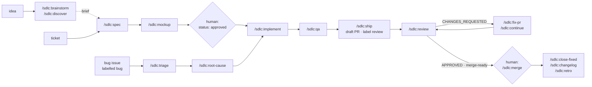

<h1 align="center">aisdlc</h1>

<p align="center">
  <b>🧭 discover · 📝 spec · 🔨 implement · ✅ qa · 🚢 ship · 🔍 review · 🤝 merge</b><br/>
  An AI SDLC harness for Claude Code: 31 commands, 10 skills and a queue that turn an approved spec — or a labelled bug — into a reviewed pull request, unattended, on a cheap model.
</p>

<p align="center">
  <a href="https://skills.sh/emgiezet/aisdlc"></a>
  <a href=".claude-plugin/marketplace.json"></a>
  <a href=".github/workflows/validate.yml"></a>
  <a href="LICENSE"></a>
</p>

Agents write the code; people own the specification. That is spec-driven development with the
emphasis moved: the spec is not a document that aligns humans before they type, it is the input
an agent executes without supervision. Everything the harness adds exists to make that safe on a
cheap model — a task router so an agent loads only what its task needs, a spec format whose
acceptance criteria are observable, hooks that make deleting a test impossible, an independent QA
pass, a review pass, and an eval harness that measures all of it on Haiku.

Measured on the bundled sandbox, Haiku, a three-use-case Go change: **10/10 assertions, $0.59,
5.4 minutes** — a test per use case carrying its id, the API contract updated in the same commit,
zero skipped tests, and a QA verdict reached by starting the service and checking it with `curl`.
The full numbers are in [`docs/ai-sdlc.md`](docs/ai-sdlc.md).

## ⚡ 30-second quickstart

**Skills only — any agent** (Claude Code, Cursor, Codex, OpenCode and [75 more](https://github.com/vercel-labs/skills#supported-agents)):

```bash
npx skills add emgiezet/aisdlc --skill '*'
```

That installs the ten knowledge skills — the spec format, the test-density rules, the
architecture-review tier table, the pipeline contracts — so any agent you already use writes
specs and tests the way this harness expects. Drop `--skill '*'` to cherry-pick.

**The full pipeline — Claude Code, Codex, Grok, omp:**

| Host | Register marketplace | First command |
|------|----------------------|---------------|
| Claude Code | `/plugin marketplace add emgiezet/aisdlc` then `/plugin install sdlc@aisdlc` | `/sdlc:init` |
| Codex | `codex plugin marketplace add <path>` then install sdlc in the Plugins Directory | `$init` |
| Grok | add `path` to `~/.grok/config.toml` under `[[marketplace.sources]]`, then install from `/plugins` | `/init` |
| omp | `omp plugin marketplace add <path>` then `omp plugin install sdlc@aisdlc` | `/sdlc:init` |

See `install.sh` (or run it) for the exact per-host steps.

**Queue runner — Claude Code only:**

```bash
# requires the claude CLI; does not work with Codex or Grok
ln -s ~/.claude/plugins/marketplaces/aisdlc/plugins/sdlc/bin/aisdlc ~/.local/bin/aisdlc
```

Requires `git` ≥ 2.31, `jq`, `flock`, the `claude` CLI (for the queue runner). `gh` only for the
`github` tracker; without one `/sdlc:init` selects the file-backed `local` provider.

### 🔐 Credentials for the queue runner

`aisdlc run` shells out to `claude -p`. It sets no credentials of its own — whatever authenticates
your `claude` CLI authenticates the queue. An API key is one option of four, not a requirement:

| Option | How | Billed against |
|---|---|---|
| Pro / Max subscription | `claude setup-token` on a machine with a browser, then export the `CLAUDE_CODE_OAUTH_TOKEN` it prints (valid one year) | your plan's message limits |
| API key | `ANTHROPIC_API_KEY` | per token, Console |
| Cloud provider | `CLAUDE_CODE_USE_BEDROCK=1` (or Vertex / Foundry) plus that cloud's credentials | your AWS / GCP / Azure bill |
| LLM gateway | `ANTHROPIC_BASE_URL` at your proxy, `ANTHROPIC_AUTH_TOKEN` for it | wherever the gateway routes |

Two things to know before picking the subscription route:

- **`ANTHROPIC_API_KEY` wins if it is set.** A key in the environment forces Console billing and
  bypasses the subscription identity, so the runner host must not export one.
- **Cost accounting goes quiet.** The queue reads `total_cost_usd` from each phase and enforces
  `--max-budget-usd`. A subscription reports no per-token cost, so `/sdlc:retro` will rank every
  task at `$0` and the spend cap stops being the real ceiling — your plan's rate window is. The
  `num_turns == 0` check still catches a phase that never ran, so a silent no-op cannot pass as
  success.

Details per option: [Claude Code deployment](https://code.claude.com/docs/en/third-party-integrations),
[Pro/Max with Claude Code](https://support.claude.com/en/articles/11145838-use-claude-code-with-your-pro-or-max-plan).

Then, once per repository, in an interactive session:

| Host | Command | What it writes |
|------|---------|----------------|
| Claude Code | `/sdlc:init` | `CLAUDE.md`, `AGENTS.md`, `.claude/playbooks/`, `.claude/rules/`, `.claude/sdlc.md` |
| Codex | `$init` | same |
| Grok | `/init` | same |
| omp | `/sdlc:init` | same |

Then ship something (Claude Code syntax shown; substitute `$spec`/`$implement` on Codex, `/spec`/`/implement` on Grok; omp uses the same `/sdlc:<command>` syntax as Claude):

```
/sdlc:spec ABC-123            → specs/ABC-123/spec.md, status: draft
   ↓ you read it, flip status: approved, commit         ← the only approval point
aisdlc add ABC-123 && aisdlc run    ← queue runner is Claude-only
```

## 🔄 Update

```bash
npx skills update            # skills installed via npx
/plugin update sdlc@aisdlc   # the Claude Code plugin
```

Updates never touch the files `/sdlc:init` generated in your repo — your router, playbooks, rules,
profile and descriptors are yours.

## 🔁 The pipeline

Three ways in: an idea (`/sdlc:brainstorm`, `/sdlc:discover`), a ticket (`/sdlc:spec`), or a bug
report (`/sdlc:fix-issue`). All of them converge on the same unattended chain and the same review
pass, and all of them stop at a draft PR that a person merges with `/sdlc:merge`.



Every PR-producing command ends with a `PR: #<n> (<url>)` line the next command consumes; every
command that acts on an issue or PR claims it first (assignee + `in-progress` + a 🤖 comment) so
two agents never build the same branch. The queue runs the chain phase by phase, each in a fresh
context: `implement → qa → ship → review`, or `triage → root-cause → implement → qa → ship →
review` for an issue.

### Why it holds together

- **The spec replaces the plan gate.** `/sdlc:implement` never asks a question: it resolves
  ambiguity from the spec and the codebase, or stops and writes `BLOCKED.md`. Nothing runs until a
  human sets `status: approved` — or, for a bug, labels the issue `bug`, which `/sdlc:triage`
  records as the approval in the spec it generates.
- **Tests are the safety net, so they are dense.** Every `UC-<n>` gets a test carrying its id, which
  makes spec coverage a `grep`. A `Stop` hook blocks any session that deleted or skipped a test; a
  `PreToolUse` hook blocks force pushes and `--no-verify`.
- **QA and review run before a human does.** `auto-qa` re-derives the use cases from the spec
  *before* reading the code; `code-reviewer` reads the spec before the diff. `PASS`/`GAPS` is the
  first line of the PR; `APPROVED`/`CHANGES_REQUESTED` sets its label.
- **Merging stays human.** `/sdlc:merge` checks the gates and squash-merges, but only when a person
  runs it. The queue never merges.
- **Cost is bounded and recorded.** A per-phase spend cap, the actual cost in each task's record,
  and `/sdlc:retro` to rank what the harness cost, by cause.

## 📦 Catalog

### 🤖 Queueable commands

Run unattended by `aisdlc run`, or by hand. They claim their work, act in an isolated worktree,
never ask, and end with a verdict and a chain marker.

| Command | What it does |
|---|---|
| `/sdlc:implement <T>` | Refuses anything not `approved`; one playbook; a test carrying each `UC-<n>` before its code; full CI matrix; `BLOCKED.md` rather than a broken finish. |
| `/sdlc:qa <T>` | Independent verification: use cases re-derived from the spec, gaps closed, a browser pass with screenshots for UI use cases when a browser is configured, `qa-report.md` with `PASS`/`GAPS`. |
| `/sdlc:ship <T> [--docs]` | Draft PR with the verdict and the riskiest changes up front, QA report as a comment, label `review`. `--docs` ships a documentation-only branch without a spec. |
| `/sdlc:review <pr#> [--autofix]` | Spec-first review in an isolated worktree: blocker/major/minor/nit, `APPROVED` or `CHANGES_REQUESTED`, pipeline label. On its own PRs an autofix loop — conflicts, then findings, then CI — with new commits only. |
| `/sdlc:fix-pr <pr#> [--ci-only]` | Drives one PR to `merge-ready`: base merge, review + autofix, CI stabilisation that classifies each red check (`real-bug` / `test-bug` / `flake` / `infra`) and never weakens one. |
| `/sdlc:continue <T\|pr#>` | Resumes a `BLOCKED.md`, a `changes-requested` review, or a PR with no plan, then re-runs implement → qa. |
| `/sdlc:autopilot <pr#> [--allow-merge]` | Diagnoses a PR's state and runs the right chain of the commands above. Never merges without the flag. |
| `/sdlc:review-prs` | Sweeps every unreviewed open PR, newest first, claim-aware. |
| `/sdlc:triage <n>` · `/sdlc:root-cause <n>` | Read-only: is the bug real and unfixed (`NO_ACTION_NEEDED` / `BUG` / `FEATURE`); writes the bugfix spec from Expected/Actual; locates the minimal change surface. |
| `/sdlc:fix-issue <n>` | The whole bug chain under one claim lock: triage → root-cause → implement → qa → ship → review. |
| `/sdlc:followup <pr#>` · `/sdlc:close-fixed` · `/sdlc:changelog` | A review nit into a tracked issue; the post-merge issue sweep; a changelog entry shipped as a docs PR. |

### 🧑‍💻 Interactive commands

They ask questions, act once, and hand control back.

| Command | What it does |
|---|---|
| `/sdlc:init [--discovery]` | The one-per-repo setup described above. |
| `/sdlc:spec <T>` | A ticket, URL, file or description → `specs/<T>/spec.md` with a use-case table; adds the negative cases the ticket forgot; leaves `status: draft`. |
| `/sdlc:mockup <T>` | A clickable single-file mockup of the spec's UI use cases, including empty, loading, error and denied states. |
| `/sdlc:arch-review <EPIC\|path>` | Grades a planned architecture against its numbers: elicits the traffic profile, availability tier and RPO/RTO one question at a time, checks topology and dependency chain against what the tier forces, verdict `SOUND`/`GAPS`. |
| `/sdlc:brainstorm` · `/sdlc:discover` · `/sdlc:synthetic-users` · `/sdlc:backlog` | Discovery before a spec exists: one question at a time, evidence-tagged product briefs, synthetic panels that never count as evidence, epics and stories filed through `/sdlc:issue`. |
| `/sdlc:ux-shape` · `/sdlc:ux-setup` · `/sdlc:ux-review <pr#>` | A UX direction before the mockup; the repo's design contract as a path-scoped rule; a PR's UI reviewed against it in a real browser. |
| `/sdlc:issue "<brief>" \| <n> [--normalize] [--all]` | File a deduped, structured issue, or bring existing ones up to the template. |
| `/sdlc:merge <pr#>` · `/sdlc:merge-buddy` | The human's merge — refused unless `merge-ready`, green, conflict-free, no blocking `GAPS`; a read-only report of what can merge now. |
| `/sdlc:test-env` · `/sdlc:integration-tests <T>` | Boot the app portably and reuse it warm; write E2E tests against the running app with real locators. |
| `/sdlc:retro [--since]` | Classify finished runs, rank causes by cost and wall-clock, map each to the harness file that owns it. |

### 🧠 Skills

Installable on their own with `npx skills add emgiezet/aisdlc --skill <name>`.

| Skill | What it provides |
|---|---|
| `spec-authoring` | The spec format: fixed sections plus a table of atomic, observably-testable criteria with stable ids. Sizing, anti-patterns, readiness checklist. |
| `dense-testing` | Density floors per changed symbol, `UC-<n>` ids in test names, assert-on-observable-behaviour, the non-negotiables the guard hook enforces. |
| `task-router` | The three-tier instruction hierarchy — router, task-scoped playbooks, path-scoped rules — with line budgets and how to diagnose a router that loads the wrong file. |
| `code-review` | Severity scale, the verdict rule, the review checklist, the five lenses of a specification review. |
| `architecture-review` | Availability tiers 99.5 → 99.999 with the downtime, topology, deploy strategy and RPO/RTO each forces; dependency-chain arithmetic; traffic-profile rules; the `Non-functional targets` block. |
| `pipeline-contracts` | The vocabulary every command shares: descriptors and their operations, chain markers, verdict tokens, the claim lock, pipeline labels, the bugfix approval rule. |
| `discovery` | Brief and product-brief formats, evidence tags that never upgrade, the Definition of Ready. |
| `harness-eval` | Measuring the harness on a cheap model, and a table from each failure symptom to the instruction file that caused it. |
| `rest-api-design` | Resource naming, status-code selection, one error envelope per API, bounded pagination, idempotency, and the breaking-change table for an HTTP surface. |
| `graphql-api-design` | Nullability as a contract, mutation input/payload shape, Relay connections, the N+1 rule, where a domain error belongs, and the breaking-change table for a schema. |

Plus the `auto-qa` and `code-reviewer` agents, the `guard` hook, `bin/aisdlc`, and the shipped
descriptors: trackers `github` and `local`, browsers `playwright` and `agent-browser`.

## 👥 Workflows by role

Same pipeline, different entry points. Each role runs one or two commands; the chain does the rest.

### 📋 Product / analyst

| ▶️ You run | ⚙️ Runs inside | 🎁 You get |
|---|---|---|
| `/sdlc:discover --mode client "benefits portal"` | context gate over your research folder, interview rounds, a skeptic subagent | `specs/briefs/product-brief.md` with every claim tagged `[EVIDENCE]`, `[ASSUMPTION]` or `[SYNTHETIC]` |
| `/sdlc:brainstorm "should we add bulk archive?"` | one question at a time, a challenger subagent | a `Next:` routing line and a brief the pipeline can run with |
| `/sdlc:backlog specs/briefs/product-brief.md` | readiness check, `/sdlc:issue` per node | epics, stories with acceptance criteria and tasks in the tracker — after you have seen the tree |
| `/sdlc:issue "checkout total ignores discount"` | dedupe, six-section template | one well-formed, labelled issue |

### 🏛️ Architect

| ▶️ You run | ⚙️ Runs inside | 🎁 You get |
|---|---|---|
| `/sdlc:arch-review specs/EPIC-1/arch.md` | tier table, dependency arithmetic, the targets block written into your doc | `arch-review.md`: chain math vs stated tier, findings with the smallest fix each, `SOUND`/`GAPS` |

### 🎨 Designer

| ▶️ You run | ⚙️ Runs inside | 🎁 You get |
|---|---|---|
| `/sdlc:ux-shape "quick-add for the people list"` | states, riskiest assumption | a decided direction before anything is drawn |
| `/sdlc:mockup ABC-123` | the spec's UI use cases | a clickable single-file mockup to validate with whoever asked |
| `/sdlc:ux-setup` once, then `/sdlc:ux-review 123` | design contract as a rule; the browser descriptor | a UI review judged against your own design system, with screenshots |

### 👩‍💻 Developer

| ▶️ You run | ⚙️ Runs inside | 🎁 You get |
|---|---|---|
| `/sdlc:spec ABC-123` → approve → `aisdlc add ABC-123` | implement → qa → ship → review, worktree per task | a reviewed draft PR with its verdict on the first line |
| `/sdlc:fix-issue 42` or `aisdlc add --issue 42` | triage → root-cause → implement → qa → ship → review, one claim lock | a bug-fix PR with regression tests carrying `GH-42` |
| `/sdlc:continue ABC-123` | `BLOCKED.md` or review findings → plan → implement → qa | a stalled branch finished |

### 🧪 QA

| ▶️ You run | ⚙️ Runs inside | 🎁 You get |
|---|---|---|
| `/sdlc:test-env` | boot discovery, portable `up.sh`/`down.sh`, health check | a warm, reusable running app |
| `/sdlc:qa ABC-123` | `auto-qa`, the browser descriptor for UI use cases | `qa-report.md` with a UC×test matrix and a screenshot per UI use case |
| `/sdlc:integration-tests ABC-123` | DOM exploration, real locators | E2E tests named by use case, with artefact-based failure diagnosis |

### 🚀 Release manager

| ▶️ You run | ⚙️ Runs inside | 🎁 You get |
|---|---|---|
| `/sdlc:merge-buddy` | labels, reviews, checks, mergeability | what can merge now, what is close and why not |
| `/sdlc:fix-pr 123` | review + autofix, CI stabilisation | one PR driven to `merge-ready`, never merged |
| `/sdlc:merge 123 --followup "…"` | the four gates, squash-merge | the PR merged, or one line saying which gate refused |
| `/sdlc:close-fixed` · `/sdlc:changelog` | tracker sweep; `/sdlc:ship --docs` | issues closed, a changelog PR |

### 🔧 Harness owner

| ▶️ You run | ⚙️ Runs inside | 🎁 You get |
|---|---|---|
| `/sdlc:retro --since 2026-09-01` | `jq` over every task record | causes ranked by `$` and wall-clock, each mapped to the playbook, rule or spec format that owns it |
| `make harness-eval MODEL=haiku` | the sandbox, the queue, the scorer | proof the pipeline works on the cheap model — or the instruction file that broke it |

## 🧰 Works with any stack

Nothing here assumes a language or a product. The stacks, the exact verification commands, the
tracker, the browser, the labels and the artefact paths all come from one committed file,
`.claude/sdlc.md`, written by `/sdlc:init`:

```markdown
- **Specs live in:** `specs/`
- **Pull request label:** `ai-sdlc`
- **Kind:** `github`
- **Tracker descriptor:** `.claude/trackers/github.md`
- **Pipeline labels:** `review`, `changes-requested`, `merge-ready`, `blocked`
- **Browser descriptor:** `.claude/browsers/playwright.md`

| Stack | Paths | Lint / format | Types / static | Tests |
|-------|-------|---------------|----------------|-------|
| go | `services/**` | `gofmt -l .` | `go vet ./...` | `go test -race ./...` |
```

A Rust repo puts `cargo clippy` and `cargo test` in the table; a Go repo `go test ./...`. Commands
run whatever the table says and treat a second failure of the same command as a hard stop.

## 🎨 Make it yours

- **Your router, your playbooks, your rules** — `/sdlc:init` derives them from the repository and
  never overwrites what exists. The `task-router` skill covers how to keep them small.
- **Tracker descriptor** — no command calls `gh`. Commands name operations (**get-pr**,
  **create-pr**, **claim** …) and `.claude/trackers/<kind>.md` says how each runs. Edit it, or
  write a new one from [`TEMPLATE.md`](plugins/sdlc/templates/trackers/TEMPLATE.md) for Linear,
  Jira, or anything with a CLI. `local` is file-backed and needs no network.
- **Browser descriptor** — the same shape for `playwright` and `agent-browser`; QA and UX review
  never name a provider.
- **A policy overlay, not a fork** — organisation rules install as a second plugin beside this one.
  [`docs/overlay-contract.md`](docs/overlay-contract.md) states what an overlay may rely on.
- **Per-phase model roles** — the optional `model_roles` key in `.aisdlc/config.json` routes queue
  phases to different models without editing any agent file: `smol` for `scope-check` and `ship`,
  `default` for `implement` and `qa`, `slow` for `review` and `root-cause`. Resolution is
  snapshotted at `aisdlc add`, so a config edit never changes a queued task. The same key makes
  `/sdlc:close-fixed`, `/sdlc:merge-buddy` and `/sdlc:changelog` hand their bulk tracker reads to
  the cheap `sdlc-scribe` agent. Absent key, nothing changes.


## 🛡️ Slop Guard — project configuration

Slop Guard ships with sensible defaults but three files let you tune it without forking.

**`.slopguard.json`** (already shipped) declares which technology stacks the guard covers and,
in a monorepo, which paths belong to which stack. If the file is absent, the guard detects
stacks automatically. See [`plugins/slop-guard/docs/recommended-project-settings.json`](plugins/slop-guard/docs/recommended-project-settings.json)
for the full snippet to add to `.claude/settings.json`.

**`.slopguard/mapping/<tool>.yaml`** — retune or extend rules for tools Slop Guard already runs.
The format is identical to the plugin's own `rules/mapping/<tool>.yaml`; a project entry patches
the plugin entry field by field. Lowering a severity is allowed: silencing a noisy rule is a
legitimate project decision, and the plugin counts and reports every downgrade so it is never
silent. Example — promote one SQLFluff rule and demote another:

```yaml
rules:
  AM04:
    ap_id: AP-SQL-MAINT-002
    severity: warn
    category: maintainability
    cwe: ""
  S608:
    severity: error
```

**`.slopguard/tools/<name>.yaml`** — bring a linter the plugin does not pin. Complete working
example for SQLFluff:

```yaml
name: sqlfluff
tier: fast
match:
  globs: ["**/*.sql"]
  stacks: [sql]
resolve:
  project: [".venv/bin/sqlfluff", "vendor/bin/sqlfluff"]
  path_sha256: "9f2c…"          # sha256 of the PATH binary, if used
run:
  args: ["lint", "--format", "json", "{file}"]
  timeout: 8
parse:
  format: json
  jq: '.[] | .violations[]? | {rule: .code, line: .line_no, message: .description}'
```

**Trust model.** The plugin runs only a binary your project already installs (via
`resolve.project`, a path relative to the repo root) or one whose sha256 you declared in
`resolve.path_sha256`. It never installs a descriptor's tool itself — a missing binary is
skipped with a note, exactly like any built-in tool that is not on the machine. Every file
under `.slopguard/` requires human approval to change (the `pre-write` hook asks, same as
`.slopguard.json`).

**When to fork instead.** If you want a tool tested and maintained in the plugin itself — with
pinned fixture tests and a sha256 in `tools/tools.lock.json` — open a PR to the plugin rather
than adding a project descriptor. Descriptors are for tools upstream will never pin permanently.

**Descriptors the plugin ships ready-made.** `mypy` and `pylint` resolve imports through the
project's own interpreter, so a plugin-installed copy would report errors that do not exist.
They are shipped as descriptor templates instead — adopt one and it runs from your virtualenv,
or stays absent if you do not have it:

```bash
slopguard adopt-config mypy      # writes .slopguard/tools/mypy.yaml
slopguard adopt-config pylint    # writes .slopguard/tools/pylint.yaml
```

Pylint symbols that name a catalog anti-pattern arrive with its id and severity
(`bare-except` → AP-PY-MAINT-001, `eval-used` → AP-PY-SEC-007); the rest report as plain
findings. `slopguard adopt-config` with no argument lists both the baseline configs and the
descriptors your project has not adopted yet.

**Which tools your project is asked for.** Slop Guard only reports and installs the tools your
detected stacks can use, plus a small core set (`jq`, `betterleaks`, `shellcheck`). A Python
repository is never told it is missing PHPStan. `slopguard doctor` shows the scope it applied;
`slopguard doctor --all` reports every pinned tool regardless of stack.

**Linter configuration and what the guard reports.** When your project has its own linter
configuration (a `ruff.toml`, `.golangci.yml`, `eslint.config.*`, and so on), Slop Guard runs
that tool with your config and reports everything it finds — style, performance, maintainability,
and security. When no project config exists, the guard runs the tool with the plugin's baseline
example but reports **only security findings** and stays out of your style decisions; that is the
security overlay. Adopt a baseline config to opt in to full reporting for that tool:

```bash
slopguard adopt-config ruff        # copies configs/baseline/ruff.toml into your repo
```

The `config_source` plugin option changes the fallback behaviour globally: `overlay` (default) —
security only; `full` — all findings; `project-only` — skip the tool entirely when no project
config exists.

### What runs and when

Slop Guard wraps every edit in three layers, each at a different cost point:

**Fast tier — on every write, in the foreground (p95 < 2 s)**

Synchronous `PostToolUse` hook. Runs immediately after each file write or edit. Returns findings
to the agent before it continues. Wired tools: Ruff (Python), ESLint without type-info (JS/TS),
hadolint (Dockerfile), kube-linter (Kubernetes YAML), zizmor (GitHub Actions). Findings are
filtered to the changed lines only — existing problems in unchanged code are not re-reported every
turn. A missing tool is skipped silently with a one-time session note; it never blocks the write.

**Medium tier — after the edit batch, in the background (< 60 s)**

Async `PostToolUse` hook with `asyncRewake`. Starts after the fast hook; the agent continues
working while it runs. Only wakes the agent back if it finds new problems at `error` severity or
above — warnings and info go to the next session summary, not a mid-task interruption. Wired tools:
PHPStan (PHP), golangci-lint with `--new-from-rev` (Go), ESLint with type-info (JS/TS), tflint
(Terraform), Checkov per-file (IaC), Opengrep with the plugin's own rules (all stacks), and jscpd
directory-scoped (duplication, all code stacks). Each
tool runs only for the stack detected in the session. A three-second debounce collapses a batch of
rapid edits into one run.

**Slow tier — at turn end, in the Stop gate (< 5 min)**

`Stop` hook. Runs before the agent declares the turn complete. Covers analysis that is too expensive
for per-file runs: Psalm taint-analysis (PHP dataflow), Checkov on the whole changed directory
(IaC), and a Betterleaks scan of the full session diff. It also re-runs `slopguard deps-check` if
any dependency manifest changed, and reports (never blocks) if framework files were edited without
a Context7 documentation lookup in the session.

### Stop gate and enforcement modes

The Stop gate holds the agent on the current turn until every blocker in changed code is resolved.
It has three modes, set via the `enforcement_mode` plugin option or `.slopguard.json`:

| Mode | Blockers | Errors | Warnings |
|---|---|---|---|
| `advisory` | `additionalContext` only, never blocks | `additionalContext` only | `additionalContext` |
| `balanced` (default) | blocks turn end | `additionalContext` in Stop | `additionalContext` |
| `strict` | blocks turn end | blocks turn end | `additionalContext` |

Loop protection: the same blocker in the same file can hold the agent at most twice in a row.
After that it is downgraded to a warning and a message is shown to the user — so a genuinely
unresolvable issue never spins the agent indefinitely.

To turn the Stop gate off for a project, set `stop_gate: false` in `.slopguard.json` or in the
plugin options dialog.

### Prevention skills

Alongside the runtime checks, Slop Guard loads language-specific prevention skills that put the
rules in the agent's context before it writes any code. Each skill covers the highest-impact
anti-patterns for one stack: blockers first, then performance, then maintainability — one line
each, with the safe alternative.

| Skill | Loads when editing |
|---|---|
| `php-antipatterns` | `*.php`, `*.blade.php` |
| `go-antipatterns` | `*.go` |
| `python-antipatterns` | `*.py` |
| `ts-react-antipatterns` | `*.ts`, `*.tsx` |
| `node-antipatterns` | `*.js`, `*.mjs`, `*.cjs` |
| `sql-antipatterns` | `*.sql` |
| `iac-antipatterns` | `*.tf`, `*.yaml`, `*.yml`, `Dockerfile` (IaC context) |
| `agent-discipline` | always — AP-AGENT-001 through AP-AGENT-010 |

Tier-2 stacks (JVM, C#, Ruby, Rust) load their own skills with Opengrep-backed detection but no
type-analysis tools. `SessionStart` says which tier each detected stack runs at, so silence from
the detector is never mistaken for a clean codebase.

The `/slop-guard:secure-review` command runs a read-only security-reviewer subagent over the
current session's changed files. It cannot write or edit — it only reports.

The `/slop-guard:deslop <path>` command runs an editing subagent over a file or directory,
removing duplicate blocks and dead code flagged by jscpd and the linters. Without a test command
it performs pure deletions only — it will not rename, reorder, or merge code. Supply
`--tests <cmd>` to allow structural refactoring; the agent confirms the command passes before
finishing. `--dry-run` lists what would be changed without writing anything.

## 🏷️ Labels and the merge gate

Every PR carries the profile label (`ai-sdlc`) plus exactly one pipeline label: `review` after
ship, `changes-requested` or `merge-ready` after review, `blocked` when a person has to decide.
`in-progress` marks a claim and disappears when the claim is released. There are no priority,
risk or QA-gate labels: the QA verdict is on the PR's first line, the review verdict is the label,
and `/sdlc:merge` reads both before it will merge anything.

## 🧪 Try it without risking a real repo

```bash
make sandbox                                     # hermetic Go + JavaScript repo in the temp dir
cd /tmp/aisdlc-sandbox && make verify            # baseline must be green
aisdlc add SBX-1 --repo /tmp/aisdlc-sandbox --model haiku --no-pr --plugin-dir
aisdlc run --repo /tmp/aisdlc-sandbox --once
aisdlc logs <id>                                 # read what it actually did
```

## 🛠️ Development

```bash
make validate       # manifests, required files, instruction budgets, shellcheck
make selftest       # 41 assertions over the queue runner, using a stub claude — no API calls
make eval-dry       # skill trigger sets, structural check only
make harness-eval MODEL=haiku [SCENARIO=go-endpoint]   # the real thing; costs money
make tool-integration              # real-binary parser tests; needs pinned toolchain (CI); skips per tool otherwise
```

`make selftest` is the one to run after touching `bin/aisdlc`. It exists because a real run once
found that `claude` consumes stdin, which silently ate the queue's phase list — the kind of defect
no amount of reading catches.

The operating manual is [`docs/ai-sdlc.md`](docs/ai-sdlc.md); the specs this harness was built from
are under [`specs/`](specs/), written in its own format.

## Licence

MIT — copyright © 2026 [Max Małecki](https://mmx3.pl). Use it, fork it, ship it; keep the
copyright notice. See [`LICENSE`](LICENSE).
