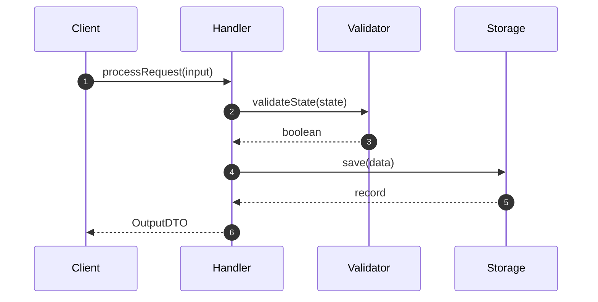

# AISDLC Enhancements & Multi-Level Planning Framework: Agent Implementation Guide

**Document Version:** 1.0  
**Target Audience:** AI Developer / Implementing Agent & System Engineers  
**System:** AISDLC (AI Software Development Life Cycle Framework) [2]  
**Grounding Sources:** Dex Horthy (HumanLayer) [2, 3], Garry Tan (Y Combinator) [1], AISDLC Architecture (README.md) [2]  

---

## 1. Executive Summary & Foundational Principles

Relying purely on test-passing harness loops (*harness engineering*) causes severe architectural degradation over time [2, 3]. Language models optimizing solely for passing tests tend to introduce superficial hacks (e.g., blanket `try-catch` blocks, improper type coercion, boundary violations) [3]. Upfront planning (30 minutes of architecture and program design) prevents hours of review and code refactoring [3].

Furthermore, as Garry Tan emphasizes, AI workflows must observe the principle: *"Never do one-off work — skillify it"* [1]. Every bug fix, QA finding, or review feedback must compound into reusable repo rules (`.claude/rules/`) managed by a "Librarian" context-management architecture [1].

This document provides complete instructions, architecture specs, system prompts, and data structures for implementing the **Multi-Level Planning Framework** (`/sdlc:arch` + `/sdlc:design`) and the **Skillify Feedback Loop** (`/sdlc:skillify`) into AISDLC.

---

## 2. Multi-Level Planning Architecture

For complex tasks and large features, planning is divided into two distinct levels prior to implementation:

```
┌─────────────────────────────────────────────────────────────────────────┐
│                          1. SPECIFICATION PHASE                         │
│   /sdlc:spec <TICKET> ──► specs/<TICKET>/spec.md (Use Cases & UC-ID)   │
└────────────────────────────────────┬────────────────────────────────────┘
                                     │ (Requires status: approved)
                                     ▼
┌─────────────────────────────────────────────────────────────────────────┐
│                      2. MACRO ARCHITECTURE PLANNING                     │
│   /sdlc:arch <TICKET> ──► specs/<TICKET>/architecture.md                │
│   • Component Boundaries & Subsystems                                  │
│   • Data Schemas, Storage, & API Contracts                              │
│   • Architectural Decision Records (ADRs) & Trade-offs                 │
└────────────────────────────────────┬────────────────────────────────────┘
                                     │
                                     ▼
┌─────────────────────────────────────────────────────────────────────────┐
│                       3. MICRO PROGRAM DESIGN                           │
│   /sdlc:design <TICKET> ──► specs/<TICKET>/design.md                    │
│   • Types, Interfaces, & Function Signatures                           │
│   • Execution Flows & Call Graphs                                       │
│   • Vertical Slices (Sequential Implementation Plan)                   │
└────────────────────────────────────┬────────────────────────────────────┘
                                     │
                                     ▼
┌─────────────────────────────────────────────────────────────────────────┐
│                     4. INCREMENTAL IMPLEMENTATION                       │
│   /sdlc:implement <TICKET>                                              │
│   • Slice 1 ──► Test ──► Slice 2 ──► Test ──► Slice N                   │
└────────────────────────────────────┬────────────────────────────────────┘
                                     │
                                     ▼
┌─────────────────────────────────────────────────────────────────────────┐
│                        5. QA & REPO LEARNING LOOP                       │
│   /sdlc:qa <TICKET>        ──► specs/<TICKET>/qa-report.md              │
│   /sdlc:skillify <TICKET>  ──► .claude/rules/<topic>.md                 │
└─────────────────────────────────────────────────────────────────────────┘
```

---

## 3. Detailed Component Specifications

### 3.1. `/sdlc:arch` — Macro Architecture Planning

**Purpose:** Evaluates system-wide impacts, integrations, state management, and architectural trade-offs for large features.

* **Trigger Condition:** Required for tickets flagged with `scale: large`, `type: epic`, or touching >3 subsystems/modules.
* **Artifact Path:** `specs/<TICKET>/architecture.md`
* **Template Structure:**

```markdown
# Architecture Specification: <TICKET-ID> — <TITLE>

## 1. System Context & Boundaries
- Affected Modules / Microservices:
- External Dependencies & APIs:
- Data Flow Diagram (Mermaid):

## 2. Architectural Decision Records (ADRs)
### ADR-01: <Decision Title>
- **Context:** <Why decision is needed>
- **Decision:** <Chosen approach>
- **Rationale & Trade-offs:** <Why option A over option B>
- **Consequences:** <Impact on latency, complexity, or security>

## 3. Data Models & Interface Contracts
- Database Schemas / Migrations:
- REST/gRPC/GraphQL API Contracts:
- Event Definitions & Payload Schemas:

## 4. Cross-Cutting Concerns
- Security & Authentication/Authorization:
- Error Handling & Resiliency Strategy:
- Observability (Logging, Metrics, Tracing):
```

---

### 3.2. `/sdlc:design` — Micro Program Design & Vertical Slices

**Purpose:** Translates high-level architecture and spec use-cases into exact code structures, method signatures, call graphs, and ordered vertical slices.

* **Artifact Path:** `specs/<TICKET>/design.md`
* **Template Structure:**

```markdown
# Program Design: <TICKET-ID> — <TITLE>

## 1. Type Definitions & Signatures
```typescript
// Key Data Structures & Domain Interfaces
export interface ServiceConfig { ... }
export type ExecutionResult = ...;

// Class & Function Signatures
export class ComponentHandler {
  public async processRequest(input: InputDTO): Promise<OutputDTO>;
  private validateState(state: State): boolean;
}
```

## 2. Call Graphs & Sequence


## 3. Vertical Slices Breakdown
- [ ] **Slice 1: Core Data Models & Validation Logic**
  - Scope: Interfaces, DTOs, pure validation functions.
  - Verification Test: `npm test tests/unit/validation.test.ts`
- [ ] **Slice 2: Storage Integration & Handler Implementation**
  - Scope: Database adapter and handler class methods.
  - Verification Test: `npm test tests/integration/handler.test.ts`
- [ ] **Slice 3: CLI Command & Error Handling Wrapper**
  - Scope: Command-line entry point and error boundaries.
  - Verification Test: `npm test tests/e2e/cli.test.ts`
```

---

### 3.3. `/sdlc:skillify` — Post-QA Learning & Rule Distillation

**Purpose:** Extracts anti-patterns, missing guardrails, and review feedback from `qa-report.md`, turning them into permanent rules in `.claude/rules/`.

* **Artifact Target:** `.claude/rules/<domain>-rules.md`
* **Rule Format:**

```markdown
---
description: Automatically generated rule from ticket <TICKET-ID>
globs: "src/**/*.ts"
---
# Rule: <Rule Title / Anti-Pattern Prevention>

## Context & Origin
Originating Ticket: `<TICKET-ID>`  
Identified Issue: Agent bypassed error handling by catching `any` and returning null without logging.

## Required Pattern
- Always log errors with structured metadata before rethrowing or wrapping.
- Do NOT use generic `catch (e: any)` without specific type narrowing.

## Bad Example (Do NOT do this)
```typescript
try {
  await execute();
} catch (e) {
  return null; // Silent failure — anti-pattern!
}
```

## Good Example (Do this instead)
```typescript
try {
  await execute();
} catch (error) {
  logger.error("Execution failed", { error, context: "ServiceHandler" });
  throw new ServiceExecutionError("Failed to process request", { cause: error });
}
```
```

---

## 4. Implementation Guidelines for the AISDLC Agent

When implementing these features into the `aisdlc` CLI/plugin codebase (`plugins/sdlc/`), the implementing agent must adhere to the following specification:

### 4.1. Task Router Integration (The "Librarian")
Modify `plugins/sdlc/router.ts` (or equivalent router logic) to automatically load contextual rule files:
1. Scan `.claude/rules/` for any rule files matching target file paths or command domains.
2. Prepend active rule contents to the system prompt of `/sdlc:design`, `/sdlc:implement`, and `/sdlc:qa`.
3. Provide a token budget check to ensure injected rules fit within context window limits.

### 4.2. Sequential Vertical Slice Executor
Modify `/sdlc:implement` execution loop:
1. Parse `specs/<TICKET>/design.md` for section `## 3. Vertical Slices Breakdown`.
2. For each slice `i`:
   a. Prompt agent to implement ONLY code and unit tests corresponding to Slice `i`.
   b. Execute designated verification command for Slice `i`.
   c. If tests pass, update checkmark `[x]` in `design.md`.
   d. If tests fail, run sub-repair loop (max 3 attempts). If unresolved, output slice error and pause.
3. Proceed to Slice `i+1` only when Slice `i` passes.

---

## 5. Verification & Quality Gates

To verify that these features are correctly implemented into AISDLC:

1. **Self-Test Suite (`make selftest`):**
   - Execute `/sdlc:arch`, `/sdlc:design`, and `/sdlc:skillify` against mock tickets.
   - Assert creation of properly formatted `architecture.md`, `design.md`, and `.claude/rules/*.md` files.

2. **Harness Evaluation (`harness-eval`):**
   - Run a benchmark ticket through the complete multi-level pipeline using the Haiku model (`aisdlc run --model haiku`).
   - Confirm that:
     - Architecture and design phases consume <15% of token budget.
     - Implementation code quality contains zero blanket try-catch hacks or missing type signatures.
     - `/sdlc:skillify` successfully extracts rules when intentional bugs are introduced in QA test cases.
